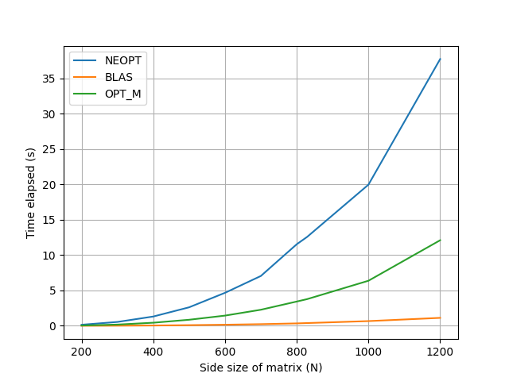

*Name: Ispas Alexandra-Petrina*
*Goup: 336CA*

# Homework 2 ASC - Optimized matrix multiplication

## The following operation is implemented:

> *C = B x A x At + Bt x B*, where:
> * A and B are square matrices
> * A is an upper triangular matrix
> * At is the transpose matrix of A
> * Bt is the transpose matrix of B
> * 'x' represents multiplication
> * '+' represents addition

### Steps:

1. compute an auxiliary matrix called D, where D = B x A
2. compute the multiplication between D and At and store it in a matrix called *E* 
3. add together the two matrices Bt x B and E

The final result is stored inside the matrix *E*, so the memory allocated for the *D*
matrix can be released.

## Unoptimized implementation
For this algoritm, I used the basic multiplication algorithm, which was also presented 
in [Lab 5](https://ocw.cs.pub.ro/courses/asc/laboratoare/05). 

I started with the first multiplication (the one between *B* and *A*) and stored the 
result in the *D* matrix. One improvement I noticed, because the *A* matrix is upper 
triangular, was that in the first multiplication, it is enogh to iterate over the second 
loop just until *k* reaches *j*. Also, in the second multiplication, *k* starts from *j*.
When computing the transpose of a matrix, all we have to do is swap the line and collumn 
indices, so the next operation is a multiplication between *D* and *A*, where the indices 
through the matrix *A* are swapped.

The preformance:
<pre><code>
Run=./tema2_neopt: N=200: Time=0.148619
Run=./tema2_neopt: N=300: Time=0.547891
Run=./tema2_neopt: N=400: Time=1.314249
Run=./tema2_neopt: N=500: Time=2.618780
Run=./tema2_neopt: N=600: Time=4.667396
Run=./tema2_neopt: N=700: Time=7.048206
Run=./tema2_neopt: N=800: Time=11.535526
Run=./tema2_neopt: N=829: Time=12.575117
Run=./tema2_neopt: N=1000: Time=19.963228
Run=./tema2_neopt: N=1200: Time=37.731621
</code></pre>

From the result of the valgrind command, I noticed that the miss rate is very big.

## Blas implementation
I used the functions <mark>cblas_dtrmm</mark> and <mark>cblas_dgemm</mark> cblas_dtrmm was used to take 
into account the fact that *A* is s triangular matrix.

### Steps:
1. D = B x A, implemented using cblas_dtrmm
2. E = D x A', implemented using cblas_dgemm
3. E += B' x B, implemented using cblas_dgemm

The performance of the algorithm is significantly improved:
<pre><code>
Run=./tema2_blas: N=200: Time=0.007240
Run=./tema2_blas: N=300: Time=0.020297
Run=./tema2_blas: N=400: Time=0.045086
Run=./tema2_blas: N=500: Time=0.091249
Run=./tema2_blas: N=600: Time=0.152610
Run=./tema2_blas: N=700: Time=0.233324
Run=./tema2_blas: N=800: Time=0.340420
Run=./tema2_blas: N=829: Time=0.387586
Run=./tema2_blas: N=1000: Time=0.666590
Run=./tema2_blas: N=1200: Time=1.124591
</code></pre>

This implementation has a smaller miss rate in comparison with the unoptimized one.

## Optimized implementation
This implementation is based on the unoptimized one and uses registers to have a 
faster access to memory. I also used only pointers for indexing through the matrices.

The performance:
<pre><code>
Run=./tema2_opt_m: N=200: Time=0.043458
Run=./tema2_opt_m: N=300: Time=0.175071
Run=./tema2_opt_m: N=400: Time=0.437182
Run=./tema2_opt_m: N=500: Time=0.857294
Run=./tema2_opt_m: N=600: Time=2.486590
Run=./tema2_opt_m: N=700: Time=4.321437
Run=./tema2_opt_m: N=800: Time=3.418982
Run=./tema2_opt_m: N=829: Time=3.774828
Run=./tema2_opt_m: N=1000: Time=6.426929
Run=./tema2_opt_m: N=1200: Time=12.103541
</code></pre>

The miss rate here is a bit smaller than in the unoptimized version, but the memory
was accessed less.

## Performance graph
Using the results presented above, I got the following graph:

From this graph, we can conclude the following:
* the optimized version is much faster than the unoptimized one, even without
using complex optimization techniques.
* the BLAS library makes the implementation a lot faster than any other approach

## Notes
The implementations can be executed on the <mark>nehalem</mark> queue. Also, the 
outputs can be checked using the script **run.sh**. The performance results from
this document are a result of the inputs defined inside the file **my_input**.
I modified the contents of the Makefile, including a new file to be compiled - 
*helper.c*, and the specific library for using BLAS.

## Bibliography
1. https://ocw.cs.pub.ro/courses/asc/laboratoare/05
2. https://developer.apple.com/documentation/accelerate/1513132-cblas_dtrmm
3. https://developer.apple.com/documentation/accelerate/1513282-cblas_dgemm
